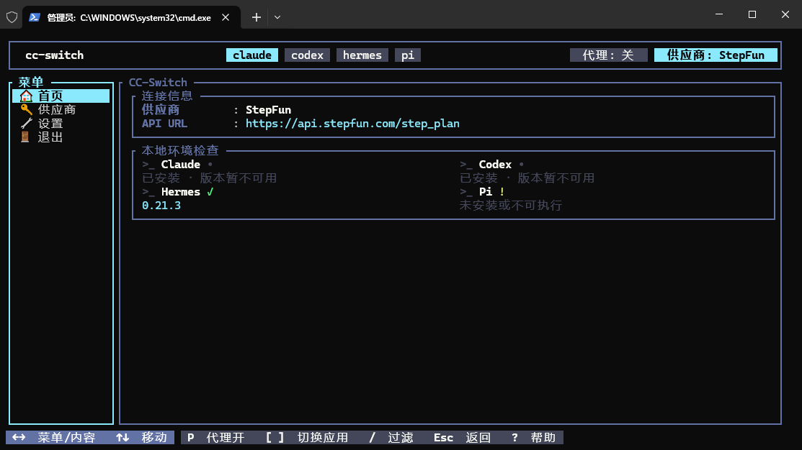

<div align="center">

# CC-Switch CLI (fbj)

**Switch Claude Code, Codex, Hermes, and Pi providers from one TUI or CLI.**

[中文](README.md) ｜ English

[](https://github.com/FengBujue0104/cc-switch-cli-fbj/releases/tag/v5.11.0)
[](https://github.com/FengBujue0104/cc-switch-cli-fbj/releases)
[](LICENSE)

</div>

---



## What this is

A personal lightweight fork of [CC-Switch CLI](https://github.com/saladday/cc-switch-cli) (upstream [CC-Switch](https://github.com/farion1231/cc-switch)). It keeps provider switching for the four harnesses that actually get used — **Claude Code, Codex, Hermes, and Pi** — and cuts everything else, while leaving provider create/edit/switch exactly as usable as upstream.

## Differences from upstream

- **Four harnesses only.** `-a/--app` accepts `claude`, `codex`, `hermes`, `pi`; `gemini`, `opencode`, and `openclaw` are rejected at the command entry point (the library still parses the retired ids so old data keeps loading). No provider-switching or live-sync code path reads or writes a removed harness's live config files (`should_sync_live` is always `false`), so switching back to an upstream or other build keeps working with them. Only two things still touch a removed harness's live files: the hidden `cc-switch config openclaw` command (writes `~/.openclaw/` config and workspace files when called explicitly, never as part of provider switching), and a one-shot credential scrub that runs at startup (removes leaked key entries from `~/.gemini/.env`, flagged so it never repeats).
- **Removed harnesses cannot come back.** The old "auto-detect available harnesses" path used to resurrect deleted harnesses in the switcher tab bar; that path is gone. `settings visible-apps` is read-only now, so a removed harness cannot be re-added.
- **Smaller command surface.** Visible top-level commands are `auth`, `provider`, `use`, `config`, `proxy`, `settings`, `start`, `daemon`, `env`, `update`, `interactive`, `completions` (`start` / `daemon` are Unix only; `proxy` is a default-on cargo feature, and `--no-default-features --features cli` drops the proxy commands); the `skills`, `mcp`, `sessions`, and `usage` entry points are removed. Hidden subcommands remain: `config openclaw`, `config webdav`, and `config s3` (the last two are backup sync and do not write removed-harness live files), plus `provider speedtest` / `stream-check` / `fetch-models` / `quota` / `usage-query`.
- **Slimmer TUI sidebar.** Every app shows only Home / Providers / Settings / Exit.
- **What is kept is unchanged.** Official Codex OAuth, unified Codex session history (`model_provider = custom`), and the optional local proxy (`cc-switch proxy enable`, API format conversion) all behave as upstream.

Unified Codex session history is on by default. Existing official (`openai`) sessions stay in that bucket until you run `cc-switch settings codex-history migrate-existing`.

## Install

Release packages are **Windows x86_64** and **Linux x86_64** (static musl) only. This fork does not ship macOS binaries.

**Linux x86_64** (static musl, no glibc dependency):

```bash
curl -fsSL https://raw.githubusercontent.com/FengBujue0104/cc-switch-cli-fbj/main/install.sh | bash
```

**Windows x86_64**:

```powershell
irm https://raw.githubusercontent.com/FengBujue0104/cc-switch-cli-fbj/main/install.ps1 | iex
```

Linux installs to `~/.local/bin` (`CC_SWITCH_INSTALL_DIR` to override); Windows installs to `%LOCALAPPDATA%\cc-switch` and adds it to the user PATH. When a previous install is found both scripts ask update-or-cancel first: Linux's `install.sh` exits with a hint to set `CC_SWITCH_FORCE=1` when there is no TTY (`/dev/tty` probe); Windows' `install.ps1` has no TTY detection at all, so in a non-interactive host `Read-Host` simply fails — `CC_SWITCH_FORCE=1` skips the prompt there too. Both scripts download `checksums.txt` and refuse to install on a SHA-256 mismatch.

## Update

```bash
cc-switch update --check     # read-only
cc-switch update             # download and replace the current binary
```

Updates come from [this repo's GitHub Releases](https://github.com/FengBujue0104/cc-switch-cli-fbj/releases), not upstream SaladDay. `cc-switch update` verifies SHA-256 from `checksums.txt` (or GitHub's asset digest). The latest tag is **v5.11.0**; anything on `5.10.6` or newer self-updates straight to it.

> Note: binaries compiled before `6c037571` (when this fork pointed `cc-switch update` at its own repo) still update from upstream `saladday/cc-switch-cli` — the fork's only earlier package, `v5.10.5-fbj.1`, is one of those. It reports its version as `5.10.5`, which is still upstream's latest release today, so it keeps saying "already latest"; the moment upstream ships something newer, those binaries will self-update to an upstream build. Reinstalling once with the command above moves them onto this repo's update channel.

Publish a new tag from a dev machine (no GitHub Actions); `<tag>` is the next version:

```bash
scripts/publish-release.sh <tag>
```

The script is written for this WSL setup: it builds the Windows zip with `cargo.exe` and falls back to `/mnt/c/Program Files/GitHub CLI/gh.exe` when `gh` is missing. Override either path with `WIN_CARGO` / `GH`.

## Quick start

```bash
cc-switch                              # TUI
cc-switch --app claude provider list
cc-switch --app claude use <id>
cc-switch --app codex provider list
cc-switch --app codex use <id>
cc-switch auth list                    # ChatGPT / Codex OAuth accounts
cc-switch settings codex-history show  # unified session-history toggle
cc-switch env check                    # environment variable conflicts
cc-switch env tools                    # local CLI tool detection
cc-switch proxy show                   # optional local proxy
```

Supported `--app` values: `claude` (default), `codex`, `hermes`, `pi`.

Unix only:

```bash
cc-switch start claude <id>
cc-switch start codex <id>
cc-switch start codex <id> --shared-sessions
```

`start` launches one session without changing the global current provider; `--shared-sessions` reuses the unified `custom` Codex history bucket.

Provider templates in the TUI add-provider form: Claude offers Custom, Claude Official, and Codex (Codex OAuth); Codex offers Custom and OpenAI Official; both plus Pi carry the built-in presets DeepSeek, Zhipu GLM, MiniMax, Xiaomi MiMo, and OpenRouter; Hermes has Custom only. The sponsor entry list is empty in this fork. (The CLI's `provider add --template` is narrower: Claude / Codex only add DeepSeek, while Pi and Hermes have Custom alone.)

In the TUI, `?` is contextual help and `esc` goes back; `p` toggles the local proxy under Claude / Codex (Hermes / Pi do not use the proxy).

## Build from source

Rust 1.91.1+ (the repo pins that channel in `rust-toolchain.toml`, so rustup installs it automatically):

```bash
git clone https://github.com/FengBujue0104/cc-switch-cli-fbj.git
cd cc-switch-cli-fbj/src-tauri
cargo build --release
```

Linux release binary:

```bash
cargo build --release --target x86_64-unknown-linux-musl
```

## License

MIT. Original author Jason Young; CLI fork saladday; this personal fork FengBujue0104.
